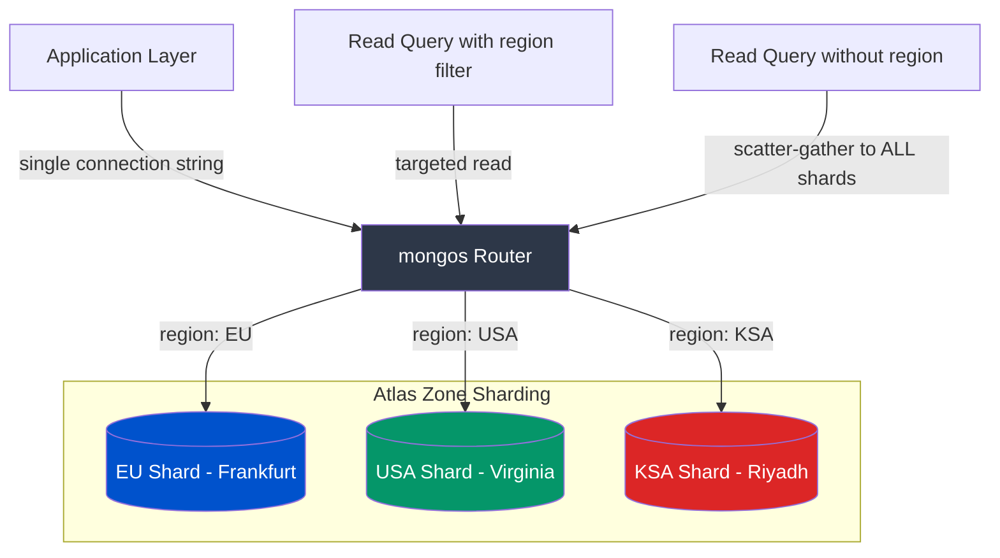

# Multi-Region Mongo Patterns

MongoDB Atlas zone sharding patterns for GDPR-compliant multi-region data residency. Ensures tenant data stays within its legal jurisdiction (EU, USA, KSA) while presenting a single global connection string to the application layer.

## Problem

GDPR Article 44 and regional data sovereignty laws (Saudi PDPL, etc.) require that personal data of residents stays within geographic boundaries. Running separate database clusters per region creates operational overhead, cross-region join complexity, and connection management nightmares.

Atlas Zone Sharding solves this: one logical cluster, one connection string, but documents are physically pinned to region-specific replica sets based on a shard key. The application writes normally; Atlas routes the data to the correct jurisdiction.

## Architecture



**Key architectural decisions:**
- **Region as shard key prefix**: Compound shard key `{ region: 1, tenantId: 1 }` ensures all data for a region lands on the same zone-tagged shard. The `region` prefix means Atlas can route writes without scatter-gather.
- **Nearest read preference**: Default read preference set to `nearest` reduces latency by reading from the geographically closest replica.
- **Region denormalization**: `region` field is stored on both `Tenant` and `User` documents. This avoids cross-collection lookups to determine data residency and enables the shard router to target reads without joins.

## Tech Stack

| Technology | Why |
|---|---|
| **MongoDB Atlas** | Managed zone sharding with geographic shard zones. Single connection string abstracts multi-region topology. |
| **Mongoose** | Schema validation + index definitions co-located with model code. Compound indexes match shard keys for optimal query routing. |
| **Express 5** | Thin API layer demonstrating zone-targeted writes and reads. |

## Key Features

- **Zone-targeted writes** -- documents automatically routed to the correct regional shard based on `region` field
- **Targeted reads** -- queries including `region` hit only the relevant shard, avoiding scatter-gather
- **Nearest read preference** -- reads served from geographically closest replica for minimum latency
- **Compound shard key indexes** -- `{ region: 1, tenantId: 1 }` indexes match Atlas zone ranges
- **Three-region support** -- EU (Frankfurt), USA (Virginia), KSA (Riyadh) with extensible region enum

## Zone Sharding Configuration

```javascript
// Atlas shell commands (run once during cluster setup):
sh.shardCollection("global_db.tenants", { "region": 1, "tenantId": 1 })
sh.addTagRange("global_db.tenants",
  { "region": "EU", "tenantId": MinKey },
  { "region": "EU", "tenantId": MaxKey },
  "EU_ZONE"
)
// Repeat for USA_ZONE and KSA_ZONE
```

## Query Routing Behavior

| Query Pattern | Routing | Latency |
|---|---|---|
| `User.find({ region: "EU", tenantId: "t1" })` | **Targeted** -- hits EU shard only | Low |
| `User.find({ tenantId: "t1" })` | **Scatter-gather** -- hits all 3 shards | High |
| `User.find({ region: "EU" }).read("nearest")` | **Targeted + nearest replica** | Lowest |

Always include `region` in queries to avoid scatter-gather.

## Scale Considerations

| Dimension | Current | Production Path |
|---|---|---|
| **Regions** | 3 (EU, USA, KSA) | Add APAC, LATAM zones -- new enum value + Atlas zone tag |
| **Tenant density** | Unbounded per region | Monitor chunk distribution; pre-split chunks for large tenants |
| **Cross-region queries** | Scatter-gather | Add materialized views or CDC-based read replicas for global analytics |
| **Compliance audit** | Application-level | Add MongoDB audit log with region filter |

## Failure Handling

1. **Region shard unavailable** -- writes to that region fail; other regions unaffected. Atlas auto-failover promotes secondary within the zone.
2. **Connection failure** -- `process.exit(1)` on startup; orchestrator (K8s/ECS) restarts the pod.
3. **Missing region in write** -- Mongoose schema validation rejects documents without valid region enum.
4. **Scatter-gather on bad query** -- performance issue, not failure. Monitor with Atlas Query Profiler.

## Setup

```bash
npm install
cp .env.example .env  # Configure MONGO_URI
npm run dev
```

```bash
# Create a tenant in EU zone
curl -X POST http://localhost:3000/api/v1/tenants \
  -H "Content-Type: application/json" \
  -d '{"tenantId": "acme-eu", "name": "Acme GmbH", "region": "EU"}'

# Query users in EU zone (targeted read)
curl http://localhost:3000/api/v1/users/EU/acme-eu
```

For local development, a single MongoDB instance simulates the topology. Zone sharding behavior only activates on Atlas with configured shard zones.

## Future Improvements

- [ ] Tenant migration tooling -- move tenant data between regions with zero downtime
- [ ] Read-your-writes consistency for cross-region admin dashboards
- [ ] CDC pipeline to sync anonymized analytics data to a global reporting cluster
- [ ] Automated compliance reporting via audit logs
- [ ] Pre-split chunk strategy for onboarding large enterprise tenants

## Deep-Dive Architecture

For a complete system design breakdown with Mermaid diagrams, visit the [System Design Portal](https://sudhanshu1402.github.io/system-design-portal/mongo-sharding).

## License

MIT

