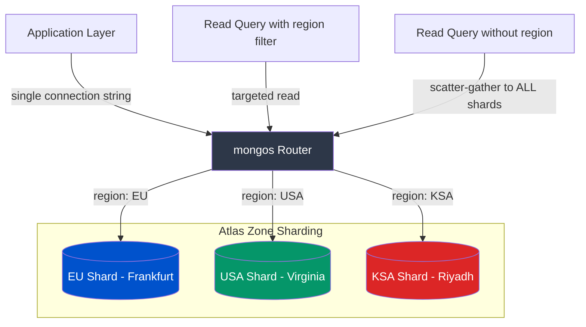

<h1>
<picture>
  <source media="(prefers-color-scheme: dark)" srcset="https://raw.githubusercontent.com/sudhanshu1402/multi-region-mongo-patterns/main/assets/banner-dark.svg" />
  <source media="(prefers-color-scheme: light)" srcset="https://raw.githubusercontent.com/sudhanshu1402/multi-region-mongo-patterns/main/assets/banner-light.svg" />
  
</picture>
</h1>

[](https://github.com/sudhanshu1402/multi-region-mongo-patterns/actions/workflows/ci.yml) [](LICENSE)


MongoDB Atlas zone-sharding patterns for data residency (GDPR, Saudi PDPL): tenant data pinned to its legal jurisdiction behind one connection string. Schema, shard keys, and query patterns only; a local MongoDB stands in for the topology, so zone routing itself needs a real Atlas cluster. A patterns reference, not a compliance product; why zone sharding beats a cluster-per-region in [docs/DESIGN.md](docs/DESIGN.md).

## Architecture


```mermaid
graph TB
    App[Application Layer] -->|single connection string| Mongos[mongos Router]
    Mongos -->|region: EU| EU[(EU Shard - Frankfurt)]
    Mongos -->|region: USA| USA[(USA Shard - Virginia)]
    Mongos -->|region: KSA| KSA[(KSA Shard - Riyadh)]

    App2[Read Query with region filter] -->|targeted read| Mongos
    App3[Read Query without region] -->|scatter-gather to ALL shards| Mongos

    subgraph "Atlas Zone Sharding"
        EU
        USA
        KSA
    end

    style Mongos fill:#2d3748,color:#fff
    style EU fill:#0052cc,color:#fff
    style USA fill:#059669,color:#fff
    style KSA fill:#dc2626,color:#fff
```

## Three decisions worth reading

**Region leads the shard key**, `{ region: 1, tenantId: 1 }`, so Atlas routes a write to one zone instead of every shard.

**Region is denormalized onto both Tenant and User.** Redundant, but it skips a cross-collection lookup to learn where a document may live.

**Residency is enforced at write time**, not by convention. `POST /users` returns 409 on a region mismatch, 404 if the tenant is missing.

## Query routing

| Query | Routing |
|---|---|
| `User.find({ region: "EU", tenantId: "t1" })` | targeted, EU shard only |
| `User.find({ tenantId: "t1" })` | scatter-gather across all three |
| `User.find({ region: "EU" }).read("nearest")` | targeted, nearest replica |

Always include `region`, that's the whole discipline. One-time Atlas zone setup: [docs/DESIGN.md](docs/DESIGN.md).

## Run it

Node 20.19 or newer.

```bash
npm install
cp .env.example .env      # MONGO_URI
npm run dev
```

curl walkthrough (create a tenant, trigger the 409) in [docs/DESIGN.md](docs/DESIGN.md). That needs a running Mongo; seeing the real zone routing needs an actual multi-region Atlas cluster, which isn't running here. What's checked without either is below.

## Proof it runs


Both blocks are captured output, not typed text: `npm run assets` runs `scripts/demo-residency.ts`, which calls `checkUserResidency` from `src/residency.ts`, then runs the suite and writes back what both printed. `npm test` covers what's verifiable without a cluster: the residency guard, `resolveReadPreference`'s fallback to `nearest`, and each schema's compound index, all via `validateSync()`, no connection. CI on Node 20 and 22. Regenerate this image: `npm run assets`.

## Rate limits

Per-IP, on by default. Every route here is unauthenticated and both POSTs insert into
Atlas, so without a cap anyone who can reach the process can fill a zone-sharded
collection as fast as the cluster accepts writes. Authentication is the real answer and is
outside what this repository demonstrates; this is the baseline in the meantime.

| Routes | Default | Override |
|---|---|---|
| `POST /api/v1/tenants`, `POST /api/v1/users` | 60 / 15 min | `WRITE_RATE_LIMIT` |
| `GET /api/v1/users/:region/:tenantId` | 300 / 15 min | `READ_RATE_LIMIT` |

Writes are tighter because they cost storage someone has to reclaim. Behind a load
balancer, set `TRUST_PROXY` to the number of proxy hops, or every request arrives from the
balancer's address and the whole internet shares one bucket.

## What it doesn't do

- No tenant migration tooling; moving a tenant between regions is manual, with downtime.
- Cross-region analytics is scatter-gather; the real answer is CDC into a reporting cluster.
- Compliance checks are application-level, no MongoDB audit log wired up.
- Rate limits count per process; more than one replica needs a shared store.

More gaps in [docs/DESIGN.md](docs/DESIGN.md).

## Deep-dive

Full breakdown at the [System Design Portal](https://sudhanshu1402.github.io/system-design-portal/mongo-sharding).

## License

MIT
