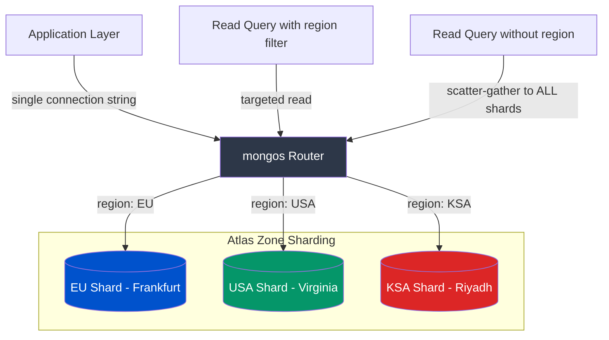

<h1>
<picture>
  <source media="(prefers-color-scheme: dark)" srcset="https://raw.githubusercontent.com/sudhanshu1402/multi-region-mongo-patterns/main/assets/banner-dark.svg" />
  <source media="(prefers-color-scheme: light)" srcset="https://raw.githubusercontent.com/sudhanshu1402/multi-region-mongo-patterns/main/assets/banner-light.svg" />
  
</picture>
</h1>

[](https://github.com/sudhanshu1402/multi-region-mongo-patterns/actions/workflows/ci.yml) [](LICENSE)

MongoDB Atlas zone-sharding patterns for data residency (GDPR, Saudi PDPL, and friends). Tenant data is physically pinned to its legal jurisdiction while the application still sees one connection string.

What's here is the schemas, compound shard keys, and query patterns. Zone routing only actually happens on a real Atlas cluster with configured zones. Locally, a single MongoDB instance stands in for the topology. It's a patterns reference, not a compliance product.

## The problem

GDPR Article 44 and similar laws say a resident's personal data stays inside a geographic boundary. Running a separate cluster per region gets you operational overhead, cross-region joins, and a connection-management mess.

Zone sharding gives one logical cluster and one connection string, with documents pinned to region-specific replica sets by shard key. The app writes normally, Atlas puts the bytes in the right country.

## Architecture


```mermaid
graph TB
    App[Application Layer] -->|single connection string| Mongos[mongos Router]
    Mongos -->|region: EU| EU[(EU Shard - Frankfurt)]
    Mongos -->|region: USA| USA[(USA Shard - Virginia)]
    Mongos -->|region: KSA| KSA[(KSA Shard - Riyadh)]

    App2[Read Query with region filter] -->|targeted read| Mongos
    App3[Read Query without region] -->|scatter-gather to ALL shards| Mongos

    subgraph "Atlas Zone Sharding"
        EU
        USA
        KSA
    end

    style Mongos fill:#2d3748,color:#fff
    style EU fill:#0052cc,color:#fff
    style USA fill:#059669,color:#fff
    style KSA fill:#dc2626,color:#fff
```

## Three decisions worth reading

**Region leads the shard key.** `{ region: 1, tenantId: 1 }`. The prefix is what lets Atlas route a write to one zone instead of asking every shard. Get the order wrong and every query is a scatter-gather.

**Region is denormalized onto both Tenant and User.** Slightly redundant, and it means no cross-collection lookup just to learn where a document is allowed to live.

**Residency is enforced at write time, not by convention.** `POST /users` returns 409 if the user's region doesn't match its tenant's zone, and 404 if the tenant doesn't exist. A record physically cannot land in a zone that violates its tenant's residency.

## Query routing

| Query | Routing |
|---|---|
| `User.find({ region: "EU", tenantId: "t1" })` | targeted, EU shard only |
| `User.find({ tenantId: "t1" })` | scatter-gather across all three |
| `User.find({ region: "EU" }).read("nearest")` | targeted, nearest replica |

Always include `region`. That's the whole discipline.

Cluster setup, run once:

```javascript
sh.shardCollection("global_db.tenants", { "region": 1, "tenantId": 1 })
sh.addTagRange("global_db.tenants",
  { "region": "EU", "tenantId": MinKey },
  { "region": "EU", "tenantId": MaxKey },
  "EU_ZONE")
// repeat for USA_ZONE and KSA_ZONE
```

## Run it

Node 20.19 or newer.

```bash
npm install
cp .env.example .env      # MONGO_URI
npm run dev
```

```bash
curl -X POST http://localhost:3000/api/v1/tenants \
  -H "Content-Type: application/json" \
  -d '{"tenantId": "acme-eu", "name": "Acme GmbH", "region": "EU"}'

# same zone, allowed
curl -X POST http://localhost:3000/api/v1/users \
  -H "Content-Type: application/json" \
  -d '{"email": "ana@acme.eu", "tenantId": "acme-eu", "region": "EU"}'

# wrong zone for that tenant, 409
curl -X POST http://localhost:3000/api/v1/users \
  -H "Content-Type: application/json" \
  -d '{"email": "ana@acme.eu", "tenantId": "acme-eu", "region": "USA"}'

curl http://localhost:3000/api/v1/users/EU/acme-eu
```

## Tests

```bash
npm test
```

Covers what's verifiable without a cluster: the residency guard across all four outcomes, `resolveReadPreference` falling back to `nearest` on any typo or wrong case, and Mongoose schema validation plus the region-leading compound index on both models. Uses `validateSync()`, so no database connection. CI on Node 20 and 22.

## What it doesn't do

- No tenant migration tooling. Moving a tenant between regions is a manual, downtime-shaped problem.
- Cross-region analytics is scatter-gather. Real answer is CDC into a separate reporting cluster.
- Compliance checks are application-level. No MongoDB audit log wired up.
- No chunk pre-splitting, so onboarding one enormous tenant will distribute badly.
- Three regions hardcoded in the enum. Adding APAC is an enum value plus an Atlas zone tag.

## Deep-dive

Full breakdown at the [System Design Portal](https://sudhanshu1402.github.io/system-design-portal/mongo-sharding).

## License

MIT
